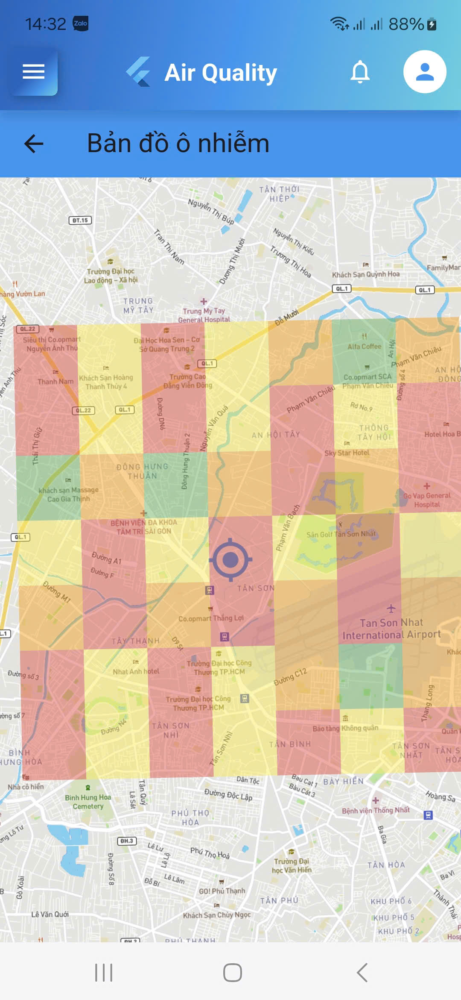
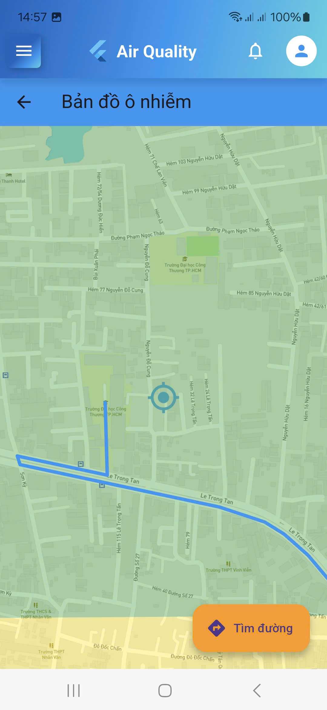
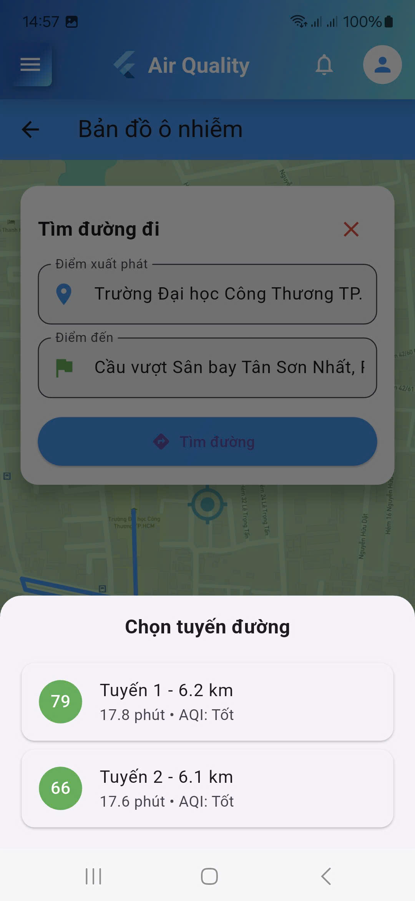

# 🌍 HUIT Vibe5 Source Code

Dự án bao gồm 2 phần chính:

- **PM25_HUIT_Vibe5** → chứa model học máy và dữ liệu liên quan để dự đoán/giám sát chất lượng không khí (PM2.5).
- **status_air** → project Flutter để xây dựng ứng dụng di động hiển thị và giám sát chất lượng không khí.


## 📂 Cấu trúc thư mục

```

HUIT_Vibe5_SourceCode/
│
├── PM25_HUIT_Vibe5/        # Model & data cho PM2.5
├── status_air/             # Flutter project (mobile app)
├── assets/                 # Ảnh chụp màn hình ứng dụng
├── .gitignore
└── README.md

```

---

## 🚀 Cách chạy project

### 1. Flutter App (`status_air`)
- Cài Flutter SDK: [Hướng dẫn cài đặt](https://docs.flutter.dev/get-started/install)
- Chạy project:
  ```bash
  cd status_air
  flutter pub get
  flutter run

### 2. Model & Data (`PM25_HUIT_Vibe5`)

* Yêu cầu **Python 3.9+**
* Tạo môi trường ảo và cài dependencies:

  ```bash
  cd PM25_HUIT_Vibe5
  python -m venv venv
  source venv/bin/activate   # Linux/macOS
  venv\Scripts\activate      # Windows
  pip install -r requirements.txt
  ```
## 📱 Ảnh chụp màn hình ứng dụng

| Ảnh 1              | Ảnh 2              |
| ------------------ | ------------------ |
|  |  |

| Ảnh 3              | Ảnh 4              |
| ------------------ | ------------------ |
|  |  |

---


